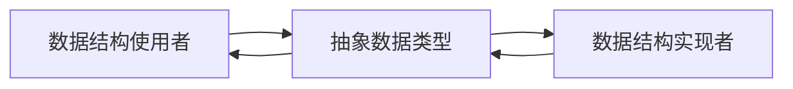
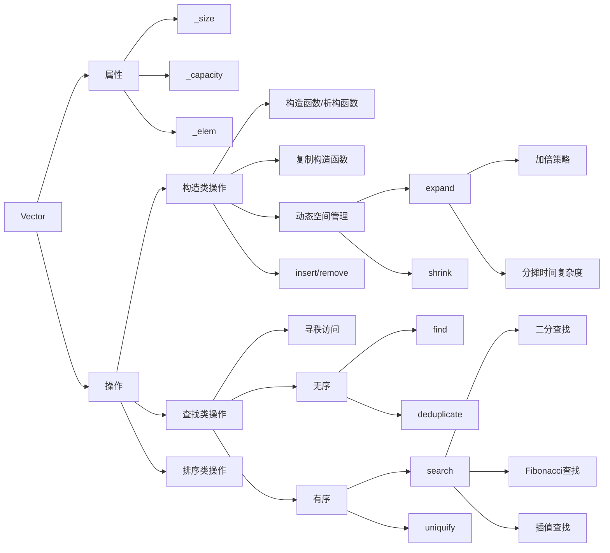
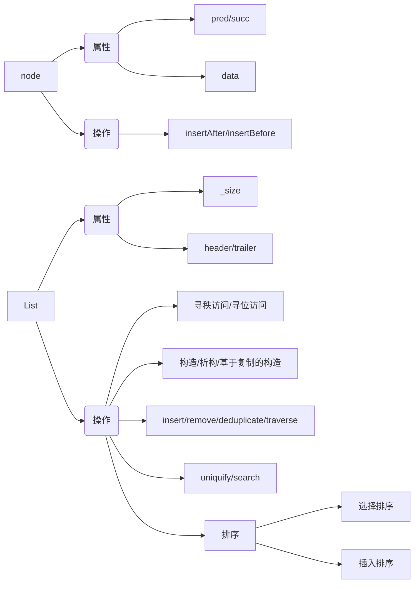

数据结构更新至绪论，算法更新至堆排序。

作为计算机基础4大件，数据结构与算法是讲如何让计算机算的对，**算的快**，能让我们高效的使用计算机。

<!--more-->

<p class="note note-primary">正在进行</p>

数据结构部分基于国家精品课程[《数据结构》](https://www.xuetangx.com/course/THU08091000384/4231547)完成，算法部分基于学校课程《计算几何与算法分析》和MIT6.006[《算法导论》](https://ocw.mit.edu/courses/electrical-engineering-and-computer-science/6-006-introduction-to-algorithms-fall-2011/index.htm)完成

# 绪论

- 程序 = 算法 + 数据结构
- 一个好算法
  - 正确
  - 高效
  - 鲁棒（能辨别不良数据，并且进行优化，不非正常退出）
  - 可读

## 评价算法
### 方法&环境

- 实验（最直接，但是不可行，因为不太方便在同一尺度下比较）

- 图灵机模型

  
  - 组成：无限长纸带、有限字母表、有限状态信息、读写头
  - 转换函数：Transition Function = (图灵机当前状态, 当前字符; 修改后的字符, 下一步前进方向, 图灵机改变后的状态)

- RAM模型
  - 无限储存空间
  - 计算时间∝计算次数

### 指标

计算规模小的问题很快就会解决，因此只用考虑足够大的问题。

只考虑算法运算时间随时间的增长率（采用渐进分析）

- 大O记号（上界,	悲观估计）
- 其他记号：Θ（同增长率），Ω（上界）

- 常见的时间复杂度
  - 常数复杂度$O(1)$
  - 对数复杂度$O(\lg n)$
  - 多项式复杂度$O(n^c)$（线性复杂度）
  - 指数复杂度$O(2^n)$

- 一些常见求时间复杂度的公式
  - $\sum\limits_{i=1}^ni^d=O(n^{d+1})$
  - 几何级数与其自身同阶$\sum\limits_{i=0}^na^n=O(a^n)$
  - $\sum\limits_{i=1}^ni^{-1}=O(\lg n)$
  - $\sum\limits_{i=1}^n\lg i=O(n\lg n)$

> 例如
>
> ```c++
> for(int i = 0; i <= n; i++){
> 	for(int j = 0; j < i; j+=j){
>         ...
>        }
> }
> ```
>
> 有$\sum\limits_{i=1}^n\lg i=O(n\lg n)$的时间复杂度

### 快速估计：封底估算

抓住主要问题进行估计

## 迭代与递归

- 空间复杂度：除输入外所需附加的空间

- 减而治之：逐步的减小问题的规模

- 分而治之：划分成两个规模相当的子问题

- 递归分析方法

  - 递归跟踪：直观、形象，仅适用于简答的递归模式

    > 把递归的函数一条条列出来，分析其中的逻辑

  - 递推分析：间接、抽象，适用于复杂的情况

    > 把递归式子写成数学归纳法的样子，然后解微分方程

## 动态规划

递归用到函数调用，效率会比较低，动态规划就是将递归变成迭代的

# 数据结构 | Data Structure

数据结构是抽象数据类型（ADT）的一种实现。ADT感觉是一种接口，它定义了一堆操作，它并不是实际存在的（类似于C++的头文件）。数据结构是根据ADT做的一种实实在在的东西。一种ADT可以有多种数据结构的实现（类似于C++的源文件）。



按照逻辑层次，数据结构可以分为

- 线性结构
- 半线性结构
- 非线性结构

## 向量 | Vector

向量就是数组的拓展，让它配合向量ADT接口。向量是一种**线性结构**，其物理位置与逻辑位置完全相同，可以执行**高效的静态操作**，如实现$O(1)$的**寻秩访问**。

向量的操作主要就是

- 构造类（构造，复制，插入，还考虑容量的增加减少）
- 查找类（无序/有序系列的查找）
- 排序类（考虑去重）



## 列表 | List

列表是另外一种线性的数据结构，与向量不同的是，它物理位置与逻辑位置不完全相同，可以执行高效的**动态操作**，寻秩访问速度较慢，主要进行的是**寻位访问**。

列表是基于结点的数据结构，其结点至少包含前驱指针、后继指针和数据三个数据。



# 算法 | Algorithm

## 排序和树

### 插入排序和归并排序

算法最经典的当然是排序算法了

**输入**: n个数的一个序列$<a_1,a_2,\cdots, a_n>$

**输出**: 输入序列的一个排序$<a_1',a_2',\cdots,a_n'>$, 满足$a_1'\leq a_2'\leq\cdots\leq a_n'$

#### 插入排序

最简单的排序方法


```c++
void insertionSort(vector<int> &A){
    for (int i = 1; i < A.size(); i++){
        int key = A[i];
        int j = i - 1;
        for (; j >= 0 && key > A[j]; j--){
            A[j + 1] = A[j];
        }
        A[j + 1] = key;
    }
}
```

时间复杂度$O(n^2)$

#### 二分插入排序

在插入排序的基础上进行的改进，由于有已经排好序的部分，在i与j进行比较的这个循环，可以使用二分查找减小运算次数。不过对大型数据种改动意义不大。


```c++
void binaryInsertionSort(vector<int> & A){
    for (int i = 1; i < A.size(); i++){
        int center;
        int left = 0;
        int right = i - 1;
        int key = A[i];
        while (left <= right){
            center = (left + right) / 2;
            if (key < A[center]){ right = center - 1; }
            else{ left = center + 1; }
        }
        for (int j = i - 1; j > right; j--){
            A[j + 1] = A[j];
        }
        A[right + 1] = key;
    }
}
```

时间复杂度还是$O(n^2)$

#### 归并排序

使用到了 **分而治之** 的思想，构建递归式子使程序时间复杂度减少


**将排序的数据由线性数组变为树状数组**（后面好多算法也有类似的思想），将$O(n)$时间复杂度的算法转换为$O(\lg n)$。

分治法与数学归纳法挺像的
$$
\begin{cases}
	\mathbf{return\ }F\left( 1 \right)&		n=1\\
	\text{划分成两个}F\left( n/2 \right) \text{，合并 }\mathbf{return}F\left( n \right)&		n>1\\
\end{cases}
$$
重点在于合并两个序列，合并方法是依次比较两个已排序子序列的第一位，依次找出并放在一个新序列中


```c++
vector<int> mergeSort(vector<int> A){
    if (A.size() == 1) { return A; }
    else{
        vector<int> B(mergeSort(vector<int>(A.begin(), A.begin() + A.size()/2)));
        vector<int> C(mergeSort(vector<int>(A.begin() + A.size()/2, A.end())));
        vector<int> D;
        bool C_flag = true;
        while(B.size() + C.size() != 0){
            if(B.size() == 0 && C_flag){
                D.push_back(C[0]);
                C.erase(C.begin());
            }else if (C.size() == 0){
                D.push_back(B[0]);
                B.erase(B.begin());
                C_flag = false;
            }else if (B[0] < C[0]){
                D.push_back(B[0]);
                B.erase(B.begin());
            }else{
                D.push_back(C[0]);
                C.erase(C.begin());
            }
        }
        return D;
    }
}
```

> 递归只要有数学归纳法的式子，写起来还挺方便


时间复杂度为$O(n\lg n)$

### 堆和堆排序

堆排序同样也使用了树的性质，将其中一步的时间复杂度由$O(n)$减小为$O(\lg n)$

堆是一个数组，可以把它看作成一个完全二叉树。它具有两种形式，最大堆和最小堆

- 最大堆：$A[\text{Parent}[i]]\geq A[i]$
- 最小堆：$A[\text{Parent}[i]]\leq A[i]$

> 完全二叉树：从左向右填充的二叉树，除了最底层其余层都排满

通过构造最大堆形式的数组（排序一般使用最大堆，优先队列一般使用最小堆），利用堆的一些性质，就可以进行高效的排序。


堆排序需要解决两个问题

- 把一个乱序的数组变成最大堆
  - 堆化
- 将最大堆中的数据排序

#### 堆化 | Heapify

堆化就是将二叉树的某个数移动到满足堆性质的位置上，具体步骤如图


$$
\text{Heapify}\left( i \right) =\begin{cases}
	\mathbf{return\ }A;&		\max =i\\
	\text{Swap}\left( A[\max]\text{,}A[i] \right) ;\text{Heapify}\left( \max \right)&		\max \ne i\\
\end{cases}\\
\max = \max\{A[i],A[\text{Child[i]}]\}
$$

```c++
void Heapify(vector<int> &A, int i, int n){
    int left_child = 2*i + 1;
    int right_child = 2*i + 2;
    int max = i;
    if((n > left_child) && A[left_child] > A[max]){
        max = left_child;
    }
    if ((n > right_child) && A[right_child] > A[max]){
        max = right_child;
    }
    if (max!=i) {
        swap(A[i], A[max]);
        Heapify(A, max, n);
    }
}
```

> 这里多了个n是为了最后一步

#### 建立堆

将杂乱无章的数据变为最大堆，可以从树的倒数第二层开始执行堆化操作，一直执行到根节点就可以了。这种做法可以保证子树都是最大堆形式的

```c++
void HeapSort(vector<int> &A){
    for (int i = A.size()/2 - 1; i >= 0; i--){
        Heapify(A, i, A.size());
    }
}
```

#### 堆排序

将根节点与最后一个节点交换，并删除最后一个节点，然后对二叉树进行Heapify操作

```c++
void HeapSort(vector<int> &A){
    BuildHeap(A);
    for (int i = A.size() - 1; i > 0; i--){
        swap(A[i], A[0]);
        Heapify(A, 0, i);
    }
}
```

参考资料：[https://www.bilibili.com/video/BV1Eb41147dK](https://www.bilibili.com/video/BV1Eb41147dK)

### 二叉搜索树

## 哈希

## 图算法

### 旅行商问题

>  NP-完全: 无法在多项式复杂度内解决？除了穷举，找不到最优

## 动态规划